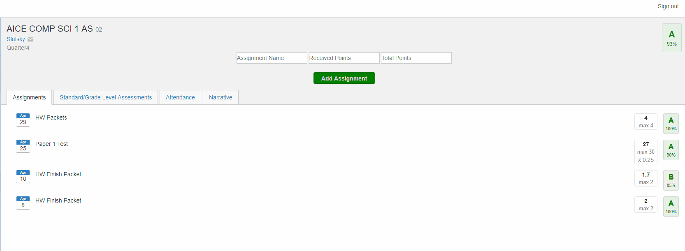

# Pinnacle-Grade-Calculator

An extension to see how an assignment will affect your class grade. 

-------------------------------------------------------------------
# Why use it?

Ever wanted to see how a grade would impact your average in a class? Well that's simple: if it does not use point systems, add up all the points you earned plus the new grade's achieved points then divide by the...

Oh wait, that might take a while. 

That's why this extension was made. You can add fake grades and your class average will automatically update based on the new grade. It even works on categories too!

-------------------------------------------------------------------

# How does it work?

After installing the extension, visit Pinnacle gradebook by Broward schools and click on one of your classes. There is a menu located to the right of the name of the class and to the left of the grade in the class. Input the name, the points achieved, and the points total and click "Add assignment". Your grade will update while you remain in the webpage and will show you what your new grade would be after adding the fake grade.
